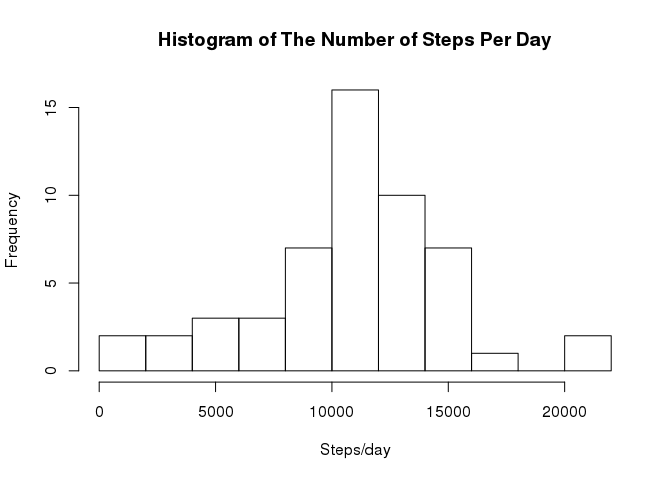
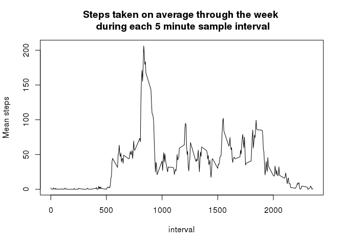
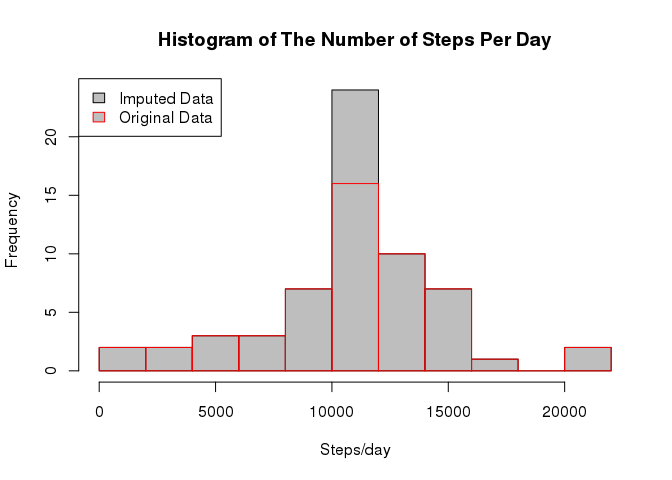
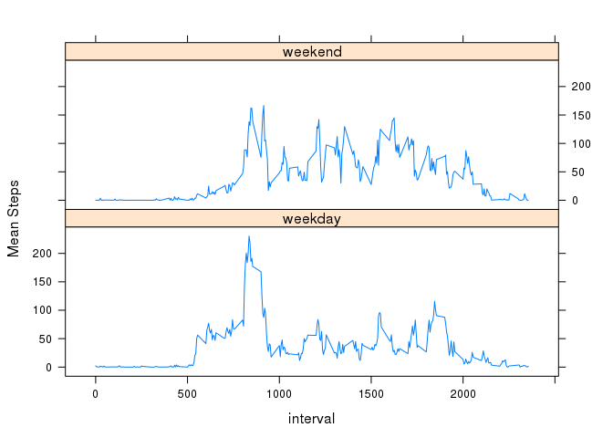

# Reproducible Research: Peer Assessment 1
## Loading required packages

```r
require(dplyr)
```

```
## Loading required package: dplyr
## 
## Attaching package: 'dplyr'
## 
## The following object is masked from 'package:stats':
## 
##     filter
## 
## The following objects are masked from 'package:base':
## 
##     intersect, setdiff, setequal, union
```

```r
require(ggplot2)
```

```
## Loading required package: ggplot2
```

```r
require(lattice)
```

```
## Loading required package: lattice
```

## Loading and preprocessing the data

When the CSV file is read in, we set *stringsasFactors* to FALSE in order to avoid unnecessary (in this case) complications caused by strings being imported as factors. We also set the classes appropriately for each column.


```r
# Set the correct working directory
setwd("/home/sean/DataScience/RepData_PeerAssessment1")
# Read in the data file
Data <- read.csv("activity.csv", stringsAsFactors = FALSE, colClasses=c("numeric", "Date", "numeric"))
```


## What is mean total number of steps taken per day?

We now want to calculate the total number of steps taken per day, dplyr is used to group the observations and sum them.


```r
stepsPerDay <- group_by(Data,date) %>%
    summarise(steps=sum(steps))
```

Now we will plot this data as a histogram - we use the Freedman-Diaconis rule to determine the bin width as that is normally pretty robust.


```r
hist(stepsPerDay$steps,breaks="FD", xlab="Steps/day", main="Histogram of The Number of Steps Per Day")
```

 

We now want to calculate the mean and median of the number of steps per day.


```r
mean <- mean(stepsPerDay$steps, na.rm=TRUE)
median <- median(stepsPerDay$steps, na.rm=TRUE)
```
 The mean = 1.0766189\times 10^{4}  
 The median = 1.0765\times 10^{4}
 
## What is the average daily activity pattern?

We now want to see how the number of steps varies as a function of time of day so we will average each of the 5 minute timeslots across all days.


```r
stepsPerTimeslot <- group_by(Data,interval) %>%
    summarise(meansteps=mean(steps, na.rm=TRUE))
plot(stepsPerTimeslot, type="l",ylab="Mean steps", main="Steps taken on average through the week \n during each 5 minute sample interval")
```

 

In order to find the timeslot which on average contains the maximumnumber of days, we'll subset by the maximum value in the number of steps.


```r
maxInterval <- subset(stepsPerTimeslot, meansteps==max(stepsPerTimeslot$meansteps))[1]
```

The 5 minute interval that contains the highest mean number of steps across all the days is **835**

## Imputing missing values

Firstly we want to see what fraction of our **original** dataset is missing (NA).


```r
print(sum(is.na(Data$steps)))
```

```
## [1] 2304
```

So we see that 2304 observations out of a total of 17568 observations have missing data - this is approximately 13% which is not negigible. We need to try to impute the missing values in order to see what effect this has if any. The strategy that we chose was to replace any NA values in the steps column with the average number of steps for the corresponding 5 minute timeslot computed ignoring NA values.

Firstly we add a new column to our original dataset with the mean corresponding to each timeslot and then replace NA values with that value -  a dplyr pipe is used to do this.


```r
imputedData <- left_join(Data, stepsPerTimeslot) %>%                # Merge data from stepsPerTimeslot - join will be on interval
                mutate(steps=ifelse(is.na(steps),meansteps,steps))  # Replace steps with the corresponding mean if its NA
```

```
## Joining by: "interval"
```

```r
print(sum(is.na(imputedData$steps)))
```

```
## [1] 0
```

So now we have no NA values in the imputed data set and visual inspection shows that values that were NA have been replaced with the mean for the relevant timeslot as we desired. Now we repeat the analysis for the imputed data.


```r
imputedstepsPerDay <- group_by(imputedData,date) %>%
    summarise(steps=sum(steps))
```


```r
hist(imputedstepsPerDay$steps,breaks="FD", xlab="Steps/day", main="Histogram of The Number of Steps Per Day",col="gray")
hist(stepsPerDay$steps,breaks="FD",border="red", add=T)
legend("topleft", legend=c("Imputed Data", "Original Data"), fill=c("gray", NULL), border=c("black", "red"))
```

 


```r
imputedmean <- mean(imputedstepsPerDay$steps)
imputedmedian <- median(imputedstepsPerDay$steps)
```

 The mean of the imputed data = 1.0766189\times 10^{4}  
 The median of the imputed data = 1.0766189\times 10^{4}
 
So we see that the mean value remains the same as it was when we simply removed the NA values from the data. However, in this case, the imputation strategy that we chose leads to the median number of steps per day being exactly the same as the mean. We also see in the histogram that the bucket that contains the mean value has a higher frequency which makes sense when one considers that we're replacing missing values with values derived from the means calculated with NA values missing.

## Are there differences in activity patterns between weekdays and weekends?

Firstly we need to add an extra column to the imputed data to classify between weekdays and the weekend. We then compute the mean number of steps per interval on weekdays and weekends, finally we use this to make a panel plot.


```r
imputedData$dayCat <- ifelse(weekdays(imputedData$date) %in% c("Saturday", "Sunday"), "weekend", "weekday")
stepsPerDayCat <- group_by(imputedData,dayCat,interval) %>%
                    summarise(steps=mean(steps))

xyplot(steps ~interval | dayCat, data=stepsPerDayCat, layout=c(1,2),type=c("l","l"), ylab="Mean Steps")
```

 

From the output of this plot, three trends are evident:

* People tend to do less walking early in the morning on the weekend than they do during the week - this is presumably due to people taking the chance to enjoy a lie in and generally being less likely to have to travel to work.
* People tend to walk more through the day on the weekend - this might be due to them taking the chance to enjoy some exercise rather than being sat at their desk during the day.
* People tend to carry on being active later in the day on the weekend than the do during the week.
